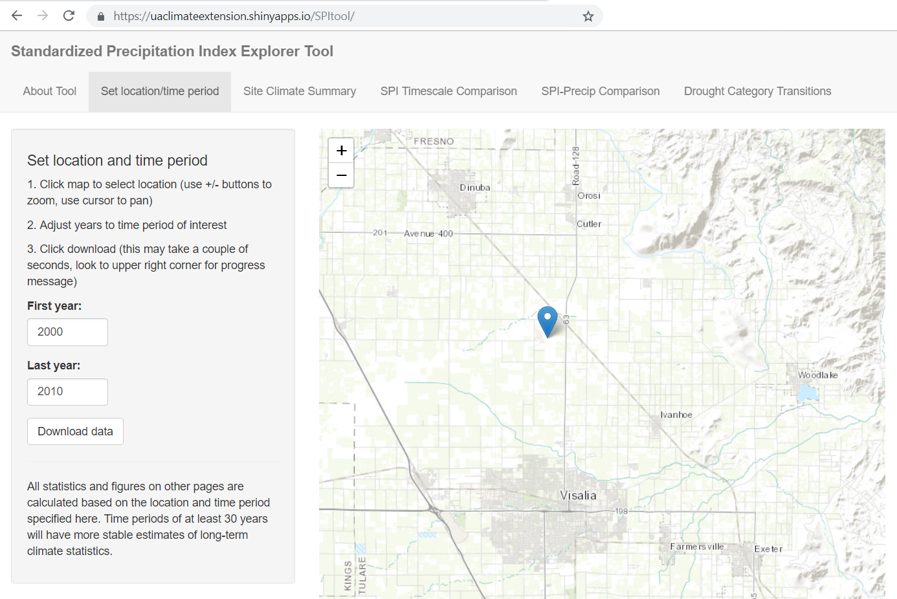

<style>
h1 {margin-top:2em; font-size:2em; font-weight:bold; color:darkgreen;}
h2 {font-size:1.5em; color:darkred;}
p, li {font-size:140%;}
.tryit {margin: 1em 2em; padding:0.5em; border:2px solid darkred; color:darkred; font-size:90%;}
li.tocify-item {font-size:100%;}
</style>

```{r setup, include=FALSE}
knitr::opts_chunk$set(echo = TRUE)
library(httr)
library(assertthat)
library(raster)
```

# Goals of the <tt>caladaptr</tt> R Package

<tt>caladaptr</tt> will be an API client package.

The intended audience is developers.

Primary role is to provide low-level functions for querying and importing Cal-Adapt data through the API.

Secondary roles might be computing generic derived dataset not yet available on the API (e.g., chill hours).

Enable light-weight decision support tools through RShiny that present Cal-Adapt data in user friendly terminology, combine with other datasets, produce user friendly output, etc. 

# Example Applications

My Ranch Climate History

Landscaping Species Selection

{style="width:640px; border:1px solid gray;"}(https://uaclimateextension.shinyapps.io/SPItool/)

# Development Plans

Build it on GitHub

Submit to [ROpenSci](https://ropensci.org/) for peer reivew

Follow the guideslines and best practices for package development: https://devguide.ropensci.org/

Convert spatial data as <tt>raster</tt> and <tt>sf</tt> objects

Incorporate <tt>tidyverse</tt> piping syntax (i.e., build queries with <tt>%>%</tt> operators)

Main dependencies: <tt>httr</tt>, <tt>sf</tt>

Working list of functions

- `ca_resources()` - names of raster series, individual rasters
- `ca_getraster()` - import raster(s)
- `ca_qryraster()` - query raster(s) 

# API Terminology

**RESOURCES**. We refer to the _datasets_ in the Cal-Adapt API as _resources_. Each resource is represented by a unique endpoint (URL). Names of resources: https://berkeley-gif.github.io/caladapt-docs/data-catalog.html

**RASTER SERIES**. A _Raster Series_ is a collection of individual rasters comprising an entire time series.

**RASTER STORE**. A _Raster Store_ is an individual raster file and associated information like spatial resolution, coordinate system reference, and bounding box.

**SLUGS**. A slug is a _URL friendly_ name of a resource in the API. Each climate dataset or resource has it’s own unique slug. A resource slug is generally composed of {variable}_{period}_{model}_{scenario}. Request an individual series with a provided slug. 

Resource URI Example: <tt>https://api.cal-adapt.org/api/series/tasmax_year_livneh/</tt>


# Searching for Data

```{r get_resources, cache=TRUE}
ca_base_url <- "http://api.cal-adapt.org/api/"   ## turn this into a function
```

<div class="tryit">
**Question for S&B**: http or https?
</div>


```{r get_resources_catalog, cache=TRUE}
## Request resources (datasets)
ca_resources_resp <- httr::GET(ca_base_url)
class(ca_resources_resp)

## Trap response problems
## Stop everything for a return code >= 400
msg_code400 <- "Server returned an error code. Check your request."
assert_that(ca_resources_resp$status_code < 400, msg = msg_code400)
## Give a warning for other things
warn_for_status(ca_resources_resp, task = "retrieve list of resources")  

## Parse the response object into a list
ca_resources_data <- httr::content(ca_resources_resp, type = "application/json")
class(ca_resources_data)
names(ca_resources_data)
ca_resources_data$series
```

# Get Details about available Raster Series

```{r rs_get_details, cache=TRUE}

(url_series_all <- paste0(ca_base_url, "series", "/"))
qry_params_lst <- list(pagesize=100)

ca_rstseries_resp <- httr::GET(url_series_all, query=qry_params_lst, httr::content_type_json())

## Trap response problems
assert_that(ca_resources_resp$status_code < 400, msg=msg_code400)
warn_for_status(ca_resources_resp, task = "retrieve list of resources")

## Convert response to a list
ca_rstseries_data <- httr::content(ca_rstseries_resp, type = "application/json")

## Explore list
names(ca_rstseries_data)
ca_rstseries_data$count
ca_rstseries_data[["next"]]
ca_rstseries_data[["previous"]]

class(ca_rstseries_data[["results"]])
names(ca_rstseries_data[["results"]])  ## no names
length(ca_rstseries_data[["results"]])

class(ca_rstseries_data[["results"]][[1]])
names(ca_rstseries_data[["results"]][[1]])
ca_rstseries_data[["results"]][[1]]$name

## Return the names of the datasets in this object
sapply(ca_rstseries_data[["results"]], function(x) x$name )

## Return the slugs of the datasets in this object
sapply(ca_rstseries_data[["results"]], function(x) x$slug)

```

<div class="tryit">
**Question for S&B**: Are the names & slugs of resources stable? (i.e., can we save them as part of the package?)

Does each Raster Series have a help page?
</div>

# Search for Resource by Name

```{r search_by_name, cache=TRUE}
(url_series_all <- paste0(ca_base_url, "series", "/"))
qry_params_lst <- list(name="yearly average maximum temperature", pagesize=100)

# Submit request
rs_maxtemp_resp <- httr::GET(url_series_all, query=qry_params_lst, httr::content_type_json())

## Trap response problems
assert_that(rs_maxtemp_resp$status_code < 400, msg=msg_code400)
warn_for_status(rs_maxtemp_resp, task = "retrieve list of resources matching name")

## Convert response to a list
rs_maxtemp_data <- httr::content(rs_maxtemp_resp, type = "application/json")

## Check for no results
rs_maxtemp_data$count
if (rs_maxtemp_data$count==0) warning("No results returned from query")
#assert_that(ca_precip3_data$count > 0)

## List names and URLs returned
sapply(rs_maxtemp_data$results, function(x) x$slug)

```

# Get the metadata details for a specific Raster Series

```{r rs_getdetails, cache=TRUE}
rseries_slug <- "tasmax_year_CNRM-CM5_rcp45"
(rseries_url <- paste0(ca_base_url, "series", "/", rseries_slug, "/"))
qry_params_lst <- list(pagesize=100)

# Submit request
rseries_tmax_resp <- httr::GET(rseries_url, query=qry_params_lst, httr::content_type_json())

## Trap response problems
assert_that(rseries_tmax_resp$status_code < 400, msg=msg_code400)
warn_for_status(rseries_tmax_resp, task = "retrieve metadata for a raster series")

## Convert response to a list
rseries_tmax_data <- httr::content(rseries_tmax_resp, type = "application/json")

## Explore results
class(rseries_tmax_data)
names(rseries_tmax_data)

rseries_tmax_data$name
rseries_tmax_data$slug; rseries_tmax_data$url
rseries_tmax_data$begin; rseries_tmax_data$end

## Convert begin and end values to R objects (POSIXlt)
(begin_dte <- strptime(rseries_tmax_data$begin, format="%Y-%m-%dT%T", tz="UTC"))
(end_dte <- strptime(rseries_tmax_data$end, format="%Y-%m-%dT%T", tz="UTC"))

## How to check for no results??

## View rasters in this Raster Series
length(rseries_tmax_data$rasters)
sapply(rseries_tmax_data$rasters, function(x) x[1])

```

<div class="tryit">
**Question for S&B**: 'Begin' and 'End' values for raster series look like: "<tt>2006-01-01T00:00:00Z"</tt>

Are there ever _time values_ associated with 'begin' and 'end' values of a Raster Series?

</div>

# Get Info about a Raster Store Object

```{r import_raster_pt1, cache=TRUE}
## First we view the raster store objects
rseries_slug <- "tasmax_year_CNRM-CM5_rcp45"
(rstore_list_url <- paste0(ca_base_url, "series", "/", rseries_slug, "/", "rasters", "/"))
qry_params_lst <- list(pagesize=100)

# Submit request
rstore_list_resp <- httr::GET(rstore_list_url, query=qry_params_lst, httr::content_type_json())

## Trap response problems
assert_that(rstore_list_resp$status_code < 400, msg=msg_code400)
warn_for_status(rstore_list_resp, task = "retrieve metadata for a raster series")

## Convert response to a list
rstore_list_data <- httr::content(rstore_list_resp, type = "application/json")

## Explore results
names(rstore_list_data)
rstore_list_data$count

class(rstore_list_data$results)
length(rstore_list_data$results)

## Look at one of the results 
class(rstore_list_data$results[[1]])
names(rstore_list_data$results[[1]])

## Look at the tile URL
rstore_list_data$results[[1]]$tileurl
```

<div class="tryit">
**Question for S&B**: can we use a Cal-Adapt tiles in a leaflet map?
</div>

```{r import_raster_pt2, cache=TRUE}
rstore_list_data$results[[1]]$units
rstore_list_data$results[[1]]$xpixsize

## Look at the geom (which in this case is the extent of the raster)
(tif_bb_lst <- rstore_list_data$results[[1]]$geom)
class(tif_bb_lst)
length(tif_bb_lst)
names(tif_bb_lst)
tif_bb_lst$type
str(tif_bb_lst$coordinates)
```

<div class="tryit">
**Puzzle**: how to work with geom objects returned from the API. 

Has to do with how <tt>httr::content()</tt> converts GeoJSON objects to nested lists of coordinates.
</div>

# Import a Raster

```{r import_raster_pt3, cache=TRUE}
## Get the URL for the first GeoTIFF
(tif_url <- rstore_list_data$results[[1]]$image)
class(tif_url)

library(raster)
this_img_ll <- raster::raster(tif_url)
this_img_ll
plot(this_img_ll, main=paste0(rstore_list_data$results[[1]]$name, "\n", rstore_list_data$results[[1]]$event))
```

<div class="tryit">
**Question for S&B**: Is there a crop option?
</div>

# Import a Raster Stack

```{r import_raster_pt4, cache=TRUE}
(tif_url <- sapply(rstore_list_data$results[1:3], function(x) x$image))

first_three_imgs <- raster::stack(tif_url)
first_three_imgs
```

# Query a Point Location

```{r qry_pt_loc1, cache=TRUE}
## Get a Point
pt <- c(-121.4687,38.5938)

## We use the sf package to convert the point to WKT
library(sf)
(pt_wkt <- st_as_text(st_point(pt)))
qry_params_lst <- list(pagesize=10, g=pt_wkt)

## As an alternative, we could convert the point to JSON 
pt2json <- function(pt) {
  return(paste0("{\"type\":\"Point\",\"coordinates\":[", pt[1], ",", pt[2], "]}")  )
}
(pt_json <- pt2json(pt))

## Construct URL
rseries_slug <- "tasmax_year_CNRM-CM5_rcp45"
(rstore_list_url <- paste0(ca_base_url, "series", "/", rseries_slug, "/", "rasters", "/"))

## Make request
rstore_qrypt_resp <- httr::GET(rstore_list_url, query=qry_params_lst, content_type_json())

## Trap response problems
assert_that(rstore_qrypt_resp$status_code < 400, msg=msg_code400)
warn_for_status(rstore_qrypt_resp, task = "retrieve pixel values at a point")

## Convert response to a list
rstore_qrypt_data <- httr::content(rstore_qrypt_resp, type = "application/json")

## Explore results
names(rstore_qrypt_data)
rstore_qrypt_data$count
length(rstore_qrypt_data$results)
names(rstore_qrypt_data$results[[1]])

## View Pixel Values at this Point
sapply(rstore_qrypt_data$results, function(x) x$image)
```

# Query a Raster Series with a User-Supplied Polygon and User-Supplied Date Range

```{r qry_yosem1, cache=TRUE}
## Load the Yosemite boundary
(yose_bnd_sf <- sf::st_read(dsn="./data", layer="yosemite_bnd"))

## Simplify the to reduce the amount of data that needs to be passed to the server
## The dTolerance level is in map units, was identified through trial-and-error
yose_bnd_simp <- sf::st_simplify(yose_bnd_sf, dTolerance = 0.01)

## Plot the original and the simplified version
plot(st_geometry(yose_bnd_sf), asp=1, border="blue")
plot(st_geometry(yose_bnd_simp), border="red", add=TRUE)

## Generate the WKT
yose_bnd_simp_wkt <- sf::st_as_text(yose_bnd_simp$geometry[1])
nchar(yose_bnd_simp_wkt)

## Generate query parameters
(qry_params_lst <- list(pagesize=100, g=yose_bnd_simp_wkt, stat='mean'))
```

<div class="tryit">
Question for S&B: what happens if you omit 'stat'?
</div>

```{r qry_yosem2, cache=TRUE}

## Get the start and end dates as R objects
(begin_date <- as.Date("2050-01-01"))
(end_date <- as.Date("2060-12-31"))
begin_date < end_date

## Generate the URL, with the begin and end date 
rseries_slug <- "tasmax_year_CNRM-CM5_rcp45"

(begin_end_url = paste0(ca_base_url, "series", "/", rseries_slug, "/", format(begin_date, "%Y-%m-%d"), "/", format(end_date, "%Y-%m-%d"), "/"))

```

<div class="tryit">
**Question for S&B**: Is this the standard way to specify a date range?
</div>

```{r qry_yosem3, cache=TRUE}
# Make request
rast_yosem_resp <- httr::GET(begin_end_url, query=qry_params_lst, content_type_json())

## Trap response problems
assert_that(rast_yosem_resp$status_code < 400, msg=msg_code400)
warn_for_status(rast_yosem_resp, task = "retrieve pixel values for an area")

## Convert response to a list
rast_yosem_data <- httr::content(rast_yosem_resp, type = "application/json")
names(rast_yosem_data)
rast_yosem_data$count

length(rast_yosem_data$results)
names(rast_yosem_data$results[[1]])
sapply(rast_yosem_data$results, function(x) x$image)

```

# Extract data by County

```{r extract_data_cty1, cache=TRUE}
(counties_base_url <- paste0(ca_base_url, "counties", "/"))

## Select a county based on a point location
pt <- c(-121.4687, 38.5938)

## Define query parameters
(qry_params_lst <- list(intersects=st_as_text(st_point(pt)), srs=4326, simplify=0.0001, precision=4))

# Request the geometry of the county that intersects this point
county_pt_resp <- httr::GET(counties_base_url, query=qry_params_lst, content_type_json())

## Trap response problems
assert_that(county_pt_resp$status_code < 400, msg=msg_code400)
warn_for_status(county_pt_resp, task = "retrieve county layer for a point location")

## Convert response to a list
county_pt_data <- httr::content(county_pt_resp, type = "application/json")

## Explore the result
county_pt_data$count
names(county_pt_data)
class(county_pt_data$features)
length(county_pt_data$features)
names(county_pt_data$features[[1]])

## Find the id of the county
(id <- county_pt_data$features[[1]]$id)
```

<div class="tryit">
**Question for S&B**: will county id numbers stay the same? Could we make a lookup table so people can select a county by name?
</div>

```{r extract_data_cty2, cache=TRUE}
## Construct a URI based on the ID to use in the next query
## Note: this URI must not include 'http://api...'
(county_uri <- paste0("/api/counties/", id, "/")) 

## Make another request to get the pixel values for this county

## Construct query parameters
(qry_params_lst <- list(pagesize=100, ref=county_uri, stat='mean'))

## Construct URL
rseries_slug <- "tasmax_year_CNRM-CM5_rcp45"
(rseries_url <- paste0(ca_base_url, "series", "/", rseries_slug, "/", "rasters", "/"))

# Request pixels in this county
rast_cty_mean_resp <- httr::GET(rseries_url, query=qry_params_lst, content_type_json())

## Trap response problems
assert_that(county_pt_resp$status_code < 400, msg=msg_code400)
warn_for_status(county_pt_resp, task = "retrieve the mean of the selected county")

## Convert response to a list
rast_cty_mean_data <- httr::content(rast_cty_mean_resp, type = "application/json")

## Explore results
names(rast_cty_mean_data)
length(rast_cty_mean_data)
class(rast_cty_mean_data$results)
names(rast_cty_mean_data$results)

class(rast_cty_mean_data$results[[1]])
names(rast_cty_mean_data$results[[1]])
rast_cty_mean_data$results[[1]]$image

## View the pixels values for this series
sapply(rast_cty_mean_data$results, function(x) x$image)
```

# Lingering Questions

Other API functions? cropping?

If, when, and where to cache results?

Store a local directory of the resources, slugs, county boundary ids, etc.

What are the highest in demand resources? Which datasets to focus on first.

How to create links to help pages / metadata

# Appendix I. Constructing Cal-Adapt API Queries

## Query Parameters

You can generally copy-paste a URI into a browser and see valid results.

**Format**. If necessary, content negotiation can be overridden by adding the format query parameter to the URL like: https://api.cal-adapt.org/api/?format=json


**PageSize and Page**. 
 
The default pagesize (number of records returned) is 10. 
 
https://api.cal-adapt.org/api/series/?pagesize=100
 
https://api.cal-adapt.org/api/series/?page=2
 
**Constructing Queries with Multiple Parameters**

First parameter should start with <tt>/?paramname=value</tt>

Concatenate additional parameters with <tt>&</tt>

Do not enclose strings in quotes. Replace spaces with '+'

Question for S&B: <tt>%20</tt> seems to work as well as <tt>+</tt>

Example:

https://api.cal-adapt.org/api/series/?name=yearly+average+maximum+temperature&pagesize=100'


