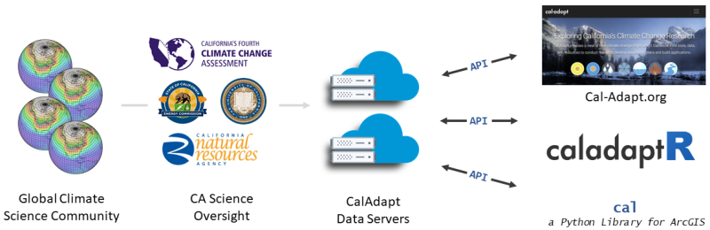
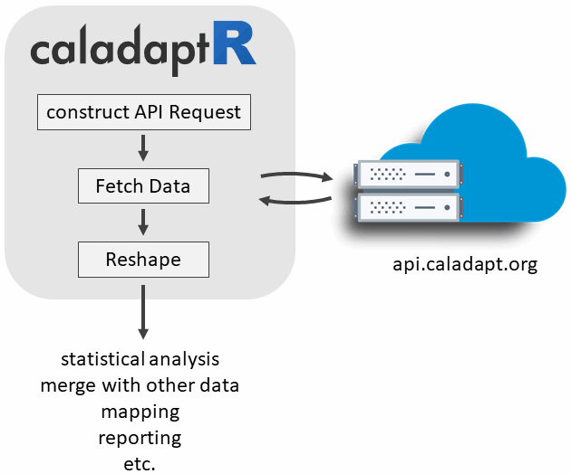

```{r setup, include=FALSE}
knitr::opts_chunk$set(echo = TRUE)
klippy::klippy()
```

```{r klippy, echo=FALSE, include=TRUE}
klippy::klippy("")
```

```{css echo = FALSE}
h1 {
  font-weight: bold;
  color: #408080;
  font-size: 22px;
}
h1.title {
  color: black;
}
h2 {
  font-weight: bold;
  font-size: 20px;
  color: black;
}

h3 {
  font-weight: bold;
  font-size: 18px;
  color: dimgray;
}
div.details {
  border: 1px solid gray;
  margin: 1em 3em;
  padding: 1em;
}
.copyme {
  background-color:#e6fee6;
}

```

\

{style="width:400px;"}

\

<!--- 
Workfow examples to add
 - start with point example
 - then add preset AOIs
---->

# Cal-Adapt

<!------
bullet points about Cal-Adapt
----->

{style="display:block; margin:1em auto;"}

\

# caladaptR

{style='width:400px;'}

- <tt>caladaptr</tt> is an **API client package** for R.

    - Primary role is to provide low-level functions for **querying** and **importing** Cal-Adapt data through the API.

    - Secondary roles might be common data munging tasks (e.g., clipping, format conversion, reshaping, spatial/temporal aggregation, etc.) 

- The intended audience is **experienced R users** (not necessarily climate scientists).

- Accepts and returns standard data classes (e.g., sf, raster)

- Built using guidelines from [rOpenSci](https://devguide.ropensci.org/){target="_blank"} with plans to submit the package for peer review. 

- Enable light-weight decision support tools through RShiny that present Cal-Adapt data in user friendly terminology, combine with other datasets, produce user friendly output, etc. 

- Plans for a companion 'cookbook' of code recipee

\

# Installation

`caladaptr` is hosted on [GitHub](https://github.com/UCANR-IGIS/caladaptr){target="_blank" rel="noopener"}. To install it, you need to have [RTools](https://cran.r-project.org/bin/windows/Rtools/){target="_blank" rel="noopener"} installed.

```{r install_caladaptr, eval = FALSE}
library(devtools)
devtools::install_github("UCANR-IGIS/caladaptr")
```

Once installed, you can load the package into memory:

```{r load_ca, cache=TRUE}
library(caladaptr)
```

# Constructing an API Call Object

You  construct an API call with a series of piped functions:

```{r eval=FALSE}
my_api_call <- ca_loc_pt() %>%     ## location
  ca_dataset() %>%                 ## dataset (GCM and emissions scenario)
  ca_cvar() %>%                    ## climate variables (options depend on)
  ca_period() %>%                  ## period of temporal aggregation (e.g., day, month, year)
  ca_dates() %>%                   ## start and end date (optional)
  ca_options()                     ## options (additional option for smoothing, rolling windows, etc)
```

<div class="details">
**Boring Details**

A Cal-Adapt API call objects is a list of class `ca_apireq`. Constructor functions fill in the different list elements. The underlying structure of a `ca_apireq` object can be seen by looking at the structure of the object returned by `ca_apireq()`"

```{r apireq}
library(caladaptr)
x <- ca_apireq()
x
```

</div>

# API Constructors

## Location Constructors

Add a location to your API call with **one** of the following: 

```{r, echo=FALSE, results='asis'}
library(kableExtra)
tbl_vec <- c("<strong>ca_loc_aoipreset()</strong>", "a preset area of interest (e.g., census tract)", "<strong>ca_loc_pt()</strong>", "points (as a data frame)", "ca_loc_sf()", "any sf data frame (point or polygon)", "ca_loc_zip()", "zipcode (centroid)")
tbl_mat <- matrix(tbl_vec, byrow=TRUE, ncol=2, dimnames=list(1:4, c("Location Function", "Accepts")))
knitr::kable(tbl_mat, format = "html", escape=FALSE) %>% kable_styling() %>% column_spec(column=1, monospace = TRUE) 
```

### `ca_loc_aoipreset()`

Cal-Adpat API has 

```{r eval=TRUE, class.source="klippy copyme"}
library(caladaptr)
args(ca_loc_aoipreset)
api1 <- ca_loc_aoipreset(type = "counties", idfld = "name", idval = "Fresno")
```

`type` can be *one* of the following:

```{r}
aoipreset_types
```

Each of the presets comes with an attribute table (data frame) that you can use to specify which specific area(s) you want to query. For this, you need to pass the name of a field with unique values, as well as the value(s) you want to query.

To get the name of field(s) you can use to specify unique areas, run `aoipreset_idflds`. For example the census tracts layers has the following fields available:

```{r}
aoipreset_idflds$censustracts
```

To see a list of valid id values you can use:

```{r}
head(aoipreset_idval$censustracts)
```

Spatial aggregation summary statistic - _**important**_

All of the preset Areas of Interest are **polygons**. This means if you want to get numeric values back (as opposed to rasters), you need to tell Cal-Adapt how you want the pixel values that cover the polygon to be summarized. The options are `mean`, `max`, `min`, `median`, and `sum`, and you pass this with the `stat` argument. Note this argument only applies if you feed your API Request to `ca_getvals()`. If you feed it got `ca_getrst()` you'll get back a raster stack for each area of interest.

### `ca_loc_pt()`

You can specify one or more point locations as your location(s) of interest using `ca_loc_pt()`. This function requires two arguments. `coords` should a two-column data frame or matrix with the x (longitude) and y (latitude) coordinates in columns 1 and 2 respectively. `id` (optional) should be a vector of unique values that identify each point.

```{r}
args(ca_loc_pt)

mypts <- data.frame(pt_id = c("Site1", "Site2", "Site3"),
                    lon = c(-122.6, -121.1, -119.4),
                    lat = c(40.1, 38.1, 35.6))

## Example
capi <- ca_loc_pt(coords = mypts[ , c("lon", "lat")], id = mypts$pt_id)
capi
```

### `ca_loc_sf()`

*coming soon!*

### `ca_loc_zip()`

*coming soon!*


## Dataset Constructors

### `ca_gcm()`

```{r eval = FALSE}
args(ca_gcm)

api1 <- api1 %>% ca_gcm(gcm = gcms[1:4])
```

### `ca_scenario()`

```{r eval = FALSE}
args(ca_gcm)

api1 <- api1 %>% ca_gcm(gcm = gcms[1:4])
```


## Climate Variables Constructors

### `ca_cvar()`

```{rn eval=FALSE}
args(ca_cvar)

api1 <- api1 %>% ca_cvar(cvar = "tasmax")

```

## Date constructors

### `ca_dates(dt1, dt2)`

dt1 and dt2 are the start and end dates of the time period of interest, and should be entered as character objects in the form 'yyyy-mm-dd'.

### `ca_years(yr1, yr2)`

*Note: temporal aggregation options are passed in `ca_loc_aoipreset()` and `ca_loc_sf)()`*.

# Data Fetching Functions

Once you have a ca_apireq object, you next feed it into a function that actually fetches data:

## getvalues

Get values (as a list or matrix).

```{r eval = FALSE}
args(ca_getvals)
```


```{r}

```


## Reshaping the output

ca_val2tbl

Pivot table example


# Example: Retrive Average Max Temperature for Point for 4 Priority GCMs and RCP45, Plot over time

(mimic the climate snapshot tool)

Select a point. Retrieve annual 

# Example 

Join with census data (using tidycensus)


# Example

Shiny GUI


# Feedback

## Preferences for retrieving values and/or rasters?

\

## Which (other) Cal-Adapt datasets would you like to work with in R?

\

## Additional options for spatial and/or temporal aggregation?

\

## Data reshaping needs

\

## Convenience functions?

Functions to help entering GCMs, scenarios, etc.

Functions to help identify AOI Presets (e.g., click on a map)

Open help pages for datasets

Other?

## Utility functions?

Get AOI Preset as a `sf` data frame

