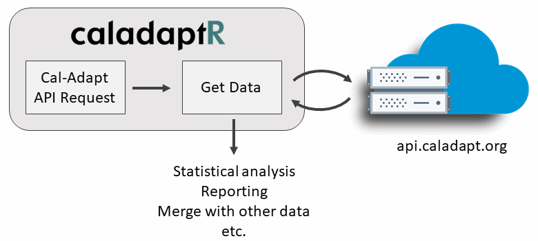

```{r setup, include=FALSE}
knitr::opts_chunk$set(echo = TRUE)
```

```{css echo = FALSE}
h1 {
  font-weight: bold;
  color: #408080;
  font-size: 22px;
}
h1.title {
  color: black;
}
h2 {
  font-weight: bold;
  font-size: 20px;
  color: black;
}

h3 {
  font-weight: bold;
  font-size: 18px;
  color: dimgray;
}
div.details {
  border: 1px solid gray;
  margin: 1em 3em;
  padding: 1em;
}

```

\


<span style="font-size:140%; font-style:italic;">Beta</span>

\

# Introduction

- <tt>caladaptr</tt> is an **API client package** for R.

    - Primary role is to provide low-level functions for **querying** and **importing** Cal-Adapt data through the API.

    - Secondary roles might be common data munging tasks (e.g., clipping, format conversion, reshaping, spatial/temporal aggregation, etc.) 

- The intended audience is **experienced R users** (not necessarily climate scientists).

- Accepts and returns standard data classes (e.g., sf, raster)

- Built using guidelines from [rOpenSci](https://devguide.ropensci.org/){target="_blank"} with plans to submit the package for peer review. 

- Enable light-weight decision support tools through RShiny that present Cal-Adapt data in user friendly terminology, combine with other datasets, produce user friendly output, etc. 

- Plans for a companion 'cookbook' of code recipee


# Usage



\

# Installation

`caladaptr` is hosted on [GitHub](https://github.com/UCANR-IGIS/caladaptr){target="_blank" rel="noopener"}. To install it, you need to have [RTools](https://cran.r-project.org/bin/windows/Rtools/){target="_blank" rel="noopener"} installed.

```{r install_caladaptr, eval = FALSE}
library(devtools)
devtools::install_github("UCANR-IGIS/caladaptr")
```

Once installed, you can load the package into memory:

```{r}
library(caladaptr)
```

# Constructing an API Call Object

You  construct an API call with a series of piped functions:

```{r eval=FALSE}
my_api_call <- ca_loc_pt() %>%     ## location
  ca_dataset() %>%                 ## dataset (GCM and emissions scenario)
  ca_cvar() %>%                    ## climate variables (options depend on)
  ca_period() %>%                  ## period of temporal aggregation (e.g., day, month, year)
  ca_dates() %>%                   ## start and end date (optional)
  ca_options()                     ## options (additional option for smoothing, rolling windows, etc)
```

<div class="details">
**Some Ugly Details**

A Cal-Adapt API call objects is a list of class `ca_apireq`. Constructor functions fill in the different list elements. The underlying structure of a `ca_apireq` object can be seen by looking at the structure of the object returned by `ca_apireq()`"

```{r}
x <- ca_apireq()
x
```

</div>

## API Constructors

### Location Constructors

```{r, echo=FALSE, results='asis'}
library(kableExtra)
tbl_vec <- c("ca_loc_aoipreset() **", "one of the preset areas of interest", "ca_loc_pt() **", "points (as a data frame)", "ca_loc_sf()", "any sf object", "ca_loc_zip()", "zipcode (centroid)")
tbl_mat <- matrix(tbl_vec, byrow=TRUE, ncol=2, dimnames=list(1:4, c("Location Function", "Accepts")))
knitr::kable(tbl_mat, format = "html") %>% kable_styling() %>% column_spec(column=1, monospace = TRUE) 
```

**`ca_loc_aoipreset()`**

```{r}
args(ca_loc_aoipreset)

api1 <- ca_loc_aoipreset(type = "counties", idfld = "name", idval = "Fresno")

```

### Dataset Constructors

**`ca_dataset()`**

```{r}
args(ca_dataset)

api1 <- api1 %>% ca_dataset(gcm = gcms[1:4], scenario = scenarios)

```

### Climate Variables Constructors

**`ca_cvar()`**

```{r}
args(ca_cvar)

api1 <- api1 %>% ca_cvar(cvar = "tasmax")

```

### Date constructors

**`ca_dates(dt1, dt2)`**  
**`ca_years(yr1, yr2)`**

*Note: temporal aggregation options are passed in `ca_options()`*


### Options constructors

- `ca_options(temporal_ag, spatial_ag)`  


*On the chopping block: ca_tempag() - temporal aggregation (now under options)  *


## Data Fetching Functions

Once you have a ca_apireq object, you next feed it into a function that actually fetches data:

Get values (as a list or matrix).

```{r eval = FALSE}
args(ca_getvals)
```

if SPARSE = TRUE & Vector AOI (whether preset of uploaded sf)

Data Structure Returned

Location: Points, Zip Codes

Plan for the general case - multiple points
  It'd be nice to include ID values with the points, so the results can be merged back
  


# Example: Retrive Maximum Daily Heat for a Single Point

\

# Feedback

## Preferences for retrieving values and/or rasters?

\

## Which (other) Cal-Adapt datasets would you like to work with in R?

\

## Additional options for spatial and/or temporal aggregation?

\

## Data reshaping needs

\

## Convenience functions?

Functions to help entering GCMs, scenarios, etc.

Functions to help identify AOI Presets (e.g., click on a map)

Open help pages for datasets

Other?

## Utility functions?

Get AOI Preset as a `sf` data frame

